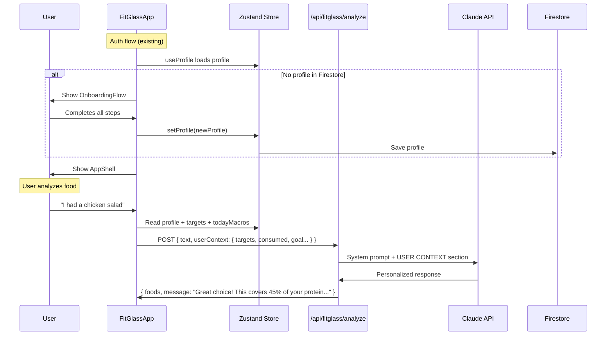

# Guided Profile Onboarding + Lens AI Personalization

## Overview

Two connected features: (1) A guided multi-step onboarding flow for first-time users to set up their profile before using the app, replacing the silent default-profile creation. (2) Pass the user's full profile context (body stats, goals, targets, today's consumed totals) to Lens on every food analysis request so it can give personalized nutritional advice.

## Problem Frame

Currently, first-time users get silently assigned a default profile (70kg, 170cm, 25yr male, maintenance) that is likely wrong for them. They see incorrect data without understanding they need to visit the Profile tab to fix it. Meanwhile, the AI assistant (Lens) has zero awareness of the user's profile — it analyzes food in a vacuum with no knowledge of calorie targets, macro goals, or daily progress.

## Requirements Trace

- R1. First-time users must complete a guided profile setup before accessing the app
- R2. The onboarding flow collects: weight, height, age, gender, activity level, goal, and rate
- R3. Users cannot skip onboarding — profile must be saved before entering the main app
- R4. Lens receives full user context on every analysis: body stats, goal, computed targets, today's consumed totals, remaining budget
- R5. Lens responses should reflect awareness of the user's profile (e.g., "this covers 40% of your protein target", "you have 650 kcal left today")
- R6. Existing users with a saved profile skip onboarding entirely
- R7. No changes to the Firestore data schema — existing `UserProfile` model is sufficient

## Scope Boundaries

- No imperial unit toggle in onboarding (metric only, matching existing app)
- No profile photo or avatar
- No onboarding for returning users — only first-time (no Firestore profile document)
- No changes to Firestore security rules
- No changes to the food analysis JSON response schema — Lens personalization is in the message text only

## Key Technical Decisions

- **Onboarding as a gated state in FitGlassApp**: Add a `needsOnboarding` state that gates before `AppShell` renders. This keeps the onboarding inside the existing auth flow rather than creating a separate route. Rationale: the app is a single-route SPA; adding a route would break the existing pattern.
- **Profile context sent client-side in request body**: The client already has profile + today's macros in Zustand. Send a `userContext` object alongside `text`/`imageBase64` in the API request body. The server injects it into Claude's system prompt. Rationale: avoids a server-side Firestore read per request, and the client is the source of truth for today's consumed totals.
- **System prompt augmentation, not replacement**: Append a `USER CONTEXT` section to the existing `FOOD_ANALYSIS_SYSTEM_PROMPT` rather than replacing it. Rationale: keeps the core food analysis instructions stable.

## Open Questions

### Resolved During Planning

- **Where does onboarding live?** Inside `FitGlassApp.tsx` as a new gated state between auth and `AppShell`. The `useProfile` hook already distinguishes "no profile exists" from "profile loaded."
- **How does the server know the user's context?** Client sends it in the request body. Server validates and injects into prompt. No server-side profile fetch needed.

### Deferred to Implementation

- Exact step-by-step animation/transition design for onboarding screens — resolve during UI implementation
- Whether to show computed targets on the final onboarding step as confirmation — try it and decide

## High-Level Technical Design

> *This illustrates the intended approach and is directional guidance for review, not implementation specification.*

## Implementation Units

- [x] **Unit 1: Build OnboardingFlow component**

  **Goal:** Create a multi-step onboarding UI that collects profile data from first-time users.

  **Requirements:** R1, R2, R3

  **Dependencies:** None

  **Files:**
  - Create: `src/app/(fitglass)/_components/onboarding/OnboardingFlow.tsx`
  - Create: `src/app/(fitglass)/_components/onboarding/StepIndicator.tsx`
  - Modify: `src/app/(fitglass)/_components/FitGlassApp.tsx`
  - Modify: `src/lib/fitglass/hooks/useProfile.ts`
  - Test: `__tests__/fitglass/onboarding.test.tsx`

  **Approach:**
  - Multi-step form with local state (not Zustand) until final submission
  - Steps: (1) Weight + Height + Age, (2) Gender, (3) Activity Level, (4) Goal + Rate (Rate step only shown when goal is `fat_loss` or `muscle_gain` — hidden for `maintenance` since rate is irrelevant)
  - Final step uses a direct `setDoc()` call to Firestore (NOT the debounced `setProfile()` path) to guarantee the profile is persisted before transitioning to AppShell. The debounced write has a 500ms delay that could leave the profile unsaved if the user transitions too quickly
  - `useProfile` needs to expose whether the profile exists vs was just created with defaults — add a `profileExists` or `needsOnboarding` flag
  - Gate in `FitGlassApp`: after auth + profile load, if `needsOnboarding` is true, show `OnboardingFlow` instead of `AppShell`
  - Reuse existing UI primitives: `ToggleButton` pattern from `ProfileView`, `NumberField` pattern, `Card`, `Button`
  - All step transitions must respect `prefers-reduced-motion` — use Framer Motion's `AnimatePresence` with the existing `usePrefersReducedMotion` hook to disable slide/fade animations when reduced motion is preferred

  **Patterns to follow:**
  - `src/app/(fitglass)/_components/profile/ProfileView.tsx` — field types, toggle buttons, number inputs
  - `src/app/(fitglass)/_components/FitGlassApp.tsx` — auth gating pattern with AnimatePresence

  **Test scenarios:**
  - Happy path: New user with no Firestore profile → `needsOnboarding` is true → OnboardingFlow renders
  - Happy path: User completes all steps → profile saved to store with correct values → transitions to AppShell
  - Edge case: Existing user with saved profile → `needsOnboarding` is false → goes straight to AppShell
  - Edge case: User is on step 3, goes back to step 1 → previous values preserved
  - Edge case: Weight at boundary (30kg min, 300kg max) → accepted; below 30 → rejected

  **Verification:**
  - First-time user sees onboarding before app content
  - Returning user skips onboarding entirely
  - Profile data persists after completing onboarding (visible on Profile tab)

- [x] **Unit 2: Build userContext payload in client**

  **Goal:** Assemble the user's profile, targets, and today's consumed totals into a `userContext` object and send it with every food analysis request.

  **Requirements:** R4

  **Dependencies:** None (can be built in parallel with Unit 1)

  **Files:**
  - Modify: `src/lib/fitglass/hooks/useFitGlassStore.ts` — update `analyzeFood` to include userContext
  - Modify: `src/lib/fitglass/services/ai.ts` — accept and send userContext in request body
  - Modify: `src/lib/fitglass/models/chat.ts` — extend `AnalyzeFoodRequest` with optional `userContext` field
  - Test: `__tests__/fitglass/user-context.test.ts`

  **Approach:**
  - Define a `UserContext` interface in the chat model: `{ dailyCalorieTarget, proteinTargetG, fatMinG, carbsRemainingG, consumedCalories, consumedProteinG, consumedCarbsG, consumedFatG, goal, weightKg, heightCm, age, gender }`
  - In `analyzeFood` action, read `profile`, `targets`, and `todayEntries` from the store, compute consumed totals using `computeMacroTotals`, and build the userContext
  - Pass userContext to `analyzeFood` service which includes it in the POST body
  - userContext is optional — if profile/targets are null, omit it (graceful degradation)

  **Patterns to follow:**
  - `src/lib/fitglass/hooks/useTodayMacros.ts` — `computeMacroTotals` function for today's totals
  - Existing `analyzeFood` action in `useFitGlassStore.ts`

  **Test scenarios:**
  - Happy path: User with complete profile + food entries → userContext includes targets and accurate consumed totals
  - Happy path: User with profile but no food entries today → consumed values are all 0
  - Edge case: User with no profile (null) → userContext omitted from request
  - Edge case: User with profile but no computed targets → userContext omitted

  **Verification:**
  - Network request to `/api/fitglass/analyze` includes `userContext` in body when profile exists
  - Request works without `userContext` when profile is missing (backwards compatible)

- [x] **Unit 3: Server-side prompt augmentation with user context**

  **Goal:** Accept `userContext` in the API route and inject it into Claude's system prompt so Lens gives personalized responses.

  **Requirements:** R4, R5

  **Dependencies:** Unit 2

  **Files:**
  - Modify: `src/app/api/fitglass/analyze/route.ts` — validate userContext, build augmented prompt
  - Modify: `src/lib/fitglass/constants/prompts.ts` — add a template/helper for the user context section
  - Test: `__tests__/fitglass/prompt-augmentation.test.ts`

  **Approach:**
  - Validate `userContext` fields in `validateRequest` — all optional, type-check if present
  - Cap numeric values to reasonable ranges as a safety measure: weight 30–300 kg, height 100–250 cm, age 13–120, calories 0–10000, macros 0–2000g. Values outside these ranges should be clamped or stripped
  - Build a `USER CONTEXT` block appended to the system prompt when userContext is present
  - The context block should include: daily targets, consumed so far, remaining budget, goal description
  - Add instruction in the prompt augmentation: "Reference the user's targets and progress in your response when relevant. Be specific with numbers."
  - Do NOT send raw profile data (no userId, email, etc.) to Claude — only nutritional context

  **Patterns to follow:**
  - Existing `validateRequest` function in the API route
  - Existing `FOOD_ANALYSIS_SYSTEM_PROMPT` structure

  **Test scenarios:**
  - Happy path: Request with valid userContext → system prompt includes USER CONTEXT section → Claude response references targets
  - Happy path: Request without userContext → system prompt unchanged → generic response (backwards compatible)
  - Edge case: userContext with some fields missing → included fields used, missing fields omitted
  - Error path: userContext with invalid types (string instead of number) → ignored/stripped, request still succeeds
  - Integration: Full round-trip — client sends userContext → server augments prompt → Claude responds with personalized message

  **Verification:**
  - Lens responses reference specific numbers from user's profile (e.g., "out of your 2100 kcal target")
  - Requests without userContext still work identically to current behavior

- [x] **Unit 4: Update Lens welcome message and chat hints**

  **Goal:** Update Lens's welcome message and remove the stale "set up your profile" hint since onboarding now handles this.

  **Requirements:** R5, R6

  **Dependencies:** Unit 1 (onboarding must be implemented first so the welcome message can assume profile always exists)

  **Files:**
  - Modify: `src/app/(fitglass)/_components/chat/ChatView.tsx` — update welcome message
  - Modify: `src/lib/fitglass/hooks/useChat.ts` — remove profile-hint logic

  **Approach:**
  - Update Lens welcome to reflect profile awareness: "Hey! I'm Lens — your personal nutrition assistant. I know your targets, so tell me what you're eating and I'll show you how it fits your plan."
  - Remove the `profile-hint` chat message injection in `useChat.ts` since onboarding guarantees profile exists
  - Exact wording to be finalized during implementation

  **Test expectation:** none — copy changes only, no behavioral logic

  **Verification:**
  - Welcome message reflects profile-aware Lens personality
  - No stale "set up your profile" hint appears

## System-Wide Impact

- **API contract change:** `/api/fitglass/analyze` request body gains an optional `userContext` field. This is additive and backwards-compatible — existing requests without it still work.
- **Auth flow change:** `FitGlassApp` gains a new gated state (onboarding) between auth-complete and AppShell. Existing users with profiles are unaffected.
- **Token usage:** Each analysis request will send ~100 extra tokens of user context in the system prompt. At 30 req/hr rate limit, this is negligible cost impact.
- **Unchanged invariants:** Firestore schema, security rules, food entry model, and existing profile editing in ProfileView are all unchanged.

## Risks & Dependencies

| Risk | Mitigation |
|------|------------|
| Onboarding blocks users who just want to try the app | Keep it to 4 quick steps — under 30 seconds to complete |
| Profile context leaks PII to Claude | Only send nutritional data (weight, age, targets) — no email, userId, or displayName |
| Stale today-totals if user logs food in another tab | Real-time `onSnapshot` listener already syncs `todayEntries` — totals recompute automatically |

## Sources & References

- Profile hook: `src/lib/fitglass/hooks/useProfile.ts`
- Store: `src/lib/fitglass/hooks/useFitGlassStore.ts`
- API route: `src/app/api/fitglass/analyze/route.ts`
- AI prompts: `src/lib/fitglass/constants/prompts.ts`
- Today's macros: `src/lib/fitglass/hooks/useTodayMacros.ts`
- Profile UI: `src/app/(fitglass)/_components/profile/ProfileView.tsx`
